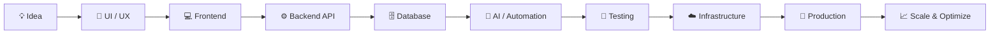

<!-- ========================================================= -->
<!--                    HIMANSHU SRIVASTAVA                     -->
<!--                     GITHUB PROFILE README                  -->
<!-- ========================================================= -->

<div align="center">

# 👋 Hi, I'm **Himanshu Srivastava**

### 🚀 Full-Stack Engineer • AI Builder • SaaS Developer • E-commerce Engineer • Trading Tool Developer


<br/>

<p>
  
  
  
  
</p>

<p>
  <a href="https://github.com/himanshu851">
    
  </a>

  <a href="mailto:srivastavah851@gmail.com">
    
  </a>

</p>

<p>
  
  
  
</p>

</div>

---

# 🚀 About Me

I’m a **Full-Stack Engineer and Product Builder** focused on creating complete production-ready digital products rather than only frontend or backend code.

I work across the complete product lifecycle:

```text
💡 Idea
   ↓
🎨 UI / Frontend
   ↓
⚙️ Backend / APIs
   ↓
🗄️ Database
   ↓
🤖 Automation / AI
   ↓
☁️ Infrastructure
   ↓
🚀 Deployment
   ↓
📈 Optimization & Scaling
```

### 💼 What I Work On

- 💻 Full-stack web application development
- 🤖 AI-powered applications & LLM integrations
- 🧩 SaaS platforms & business systems
- 🛒 E-commerce & WooCommerce development
- 🎬 OTT / video streaming systems
- 📱 Flutter mobile & web applications
- 📊 TradingView Pine Script tools
- 🔎 SEO, crawling & website audit systems
- 🔁 Workflow & business automation
- ☁️ VPS, Linux & hosting infrastructure
- 🗄️ MySQL / PostgreSQL database systems
- 🚀 GitHub, CI/CD & production deployment
- 🔐 Authentication, permissions & role systems
- 💳 Payment & shipping integrations
- 📡 APIs, webhooks & third-party services

> ### **Build. Automate. Deploy. Scale.**

---

# 🧠 Engineering Expertise

<table>
<tr>
<td width="50%" valign="top">

### ⚙️ Backend Engineering

- Laravel
- PHP
- Node.js
- Express.js
- Python
- FastAPI
- REST APIs
- Webhooks
- Authentication
- RBAC
- Background jobs
- Cron jobs
- Queue processing
- API integrations

</td>

<td width="50%" valign="top">

### 🎨 Frontend Engineering

- React
- Next.js
- JavaScript
- TypeScript
- HTML5
- CSS3
- Tailwind CSS
- Bootstrap
- Responsive UI
- Dashboard development
- Admin interfaces
- API-driven frontends

</td>
</tr>

<tr>
<td width="50%" valign="top">

### ☁️ DevOps & Infrastructure

- Ubuntu Linux
- VPS administration
- HestiaCP
- CloudPanel
- Nginx
- Apache
- PHP-FPM
- Docker
- DNS
- SSL
- GitHub Actions
- Deployment automation
- Server troubleshooting

</td>

<td width="50%" valign="top">

### 🤖 AI & Automation

- LLM integrations
- Conversational AI
- AI assistants
- Speech-to-Text
- Text-to-Speech
- Vector databases
- pgvector
- Workflow automation
- API automation
- AI-powered SaaS tools
- Automated business processes

</td>
</tr>
</table>

---

# 🔥 Featured Engineering Projects

## 🤖 JARVIS AI

> Personal AI assistant platform combining LLMs, voice interaction and persistent memory.

### Core Engineering

- 🧠 LLM integration
- 🎙️ Speech-to-Text
- 🔊 Text-to-Speech
- 💬 Conversational AI
- 🗃️ PostgreSQL-based memory
- 🧠 pgvector semantic memory
- ⚡ Next.js frontend
- 🐍 FastAPI backend
- 🔐 API-driven architecture
- 🔄 Persistent conversation workflows

**Technology Stack**

`Next.js` `React` `TypeScript` `Python` `FastAPI` `PostgreSQL` `pgvector` `Gemini`

---

## 🎬 LTV — OTT Streaming Platform

> Netflix-style OTT/video streaming platform built with Laravel.

### Features

- 🎥 Movie management
- 📺 TV show management
- 🎞️ HLS streaming
- ⚡ FFmpeg processing
- 🔄 Automatic MP4 → HLS conversion
- 🏠 Dynamic homepage sections
- 🗂️ Categories & genres
- ❤️ Watchlists
- 🕒 Watch history
- 👥 Admin / Manager / User roles
- ▶️ Custom video player integration
- 🔐 Content administration

**Technology Stack**

`Laravel` `PHP` `Blade` `Tailwind CSS` `MySQL` `FFmpeg` `HLS.js` `Plyr.js`

---

## 🛒 FeelHut — E-commerce Platform

> E-commerce system focused on product management, payments, shipping and marketplace integrations.

### Integrations & Features

- 🛍️ WooCommerce
- 💳 Razorpay
- 🚚 Shiprocket
- 🛒 Product catalog management
- 📦 Shipping automation
- 💰 Payment workflows
- 📊 Product feeds
- 🟢 Google Merchant Center
- 🔎 Technical SEO
- 📈 Search optimization
- 🔄 Commerce automation

**Technology Stack**

`WordPress` `WooCommerce` `PHP` `MySQL` `Razorpay` `Shiprocket`

---

## 🔄 Odoo ↔ WooCommerce Integration

> Order and quantity synchronization workflow connecting Odoo operations with WordPress / WooCommerce.

### Work Includes

- Order synchronization
- Product quantity updates
- Product validation
- Partial completion workflows
- Partial dispatch handling
- Completed order states
- Dispatched order states
- Wrong-product quantity protection
- WooCommerce update validation
- Business logic synchronization

**Technology Areas**

`Odoo` `WooCommerce` `WordPress` `PHP` `API Integration` `Automation`

---

## 🔢 Numerology Platform

> API-driven application with Laravel backend and Flutter-based client applications.

### Architecture

- Laravel backend
- REST API architecture
- Authentication
- Admin functionality
- Flutter mobile application
- Flutter web application
- Database integration
- Production deployment

**Technology Stack**

`Laravel` `PHP` `Flutter` `Dart` `REST APIs` `MySQL`

---

## 🐱 Kitty Platform

> Split frontend/backend application architecture with independently managed repositories.

### Backend

- PHP-based backend
- Dedicated API repository
- Separate deployment workflow

### Frontend

- React
- Vite
- Component-based UI
- Production build pipeline

**Repositories / Architecture**

```text
api.kitty
└── PHP Backend

kitty
└── React + Vite Frontend
```

**Technology Stack**

`PHP` `React` `Vite` `JavaScript` `Git` `GitHub`

---

## ☁️ CloudMail Stack

> Self-hosted mail server stack designed for Linux production environments.

### Mail Infrastructure

- Postfix
- Dovecot
- OpenDKIM
- OpenDMARC
- Rspamd
- Roundcube
- PostfixAdmin

### Engineering Focus

- Automated installation
- Mail authentication
- Server configuration
- DNS configuration
- SPF
- DKIM
- DMARC
- Security
- Mail deliverability architecture

**Technology Stack**

`Linux` `Postfix` `Dovecot` `OpenDKIM` `OpenDMARC` `Rspamd`

---

## 🖥️ Multi-Tenant VPS Hosting Infrastructure

> Multi-client production hosting architecture designed around isolated client accounts and domains.

### Infrastructure Work

- Ubuntu server administration
- HestiaCP configuration
- Multi-client accounts
- Hosting packages
- Per-client websites
- Databases
- Email accounts
- DNS configuration
- Custom nameservers
- SSL certificates
- WordPress hosting
- HTML websites
- PHP applications
- React deployments
- Database management
- Resource planning

### Server Technologies

`Ubuntu` `HestiaCP` `Nginx` `Apache` `PHP-FPM` `MariaDB` `PostgreSQL` `Fail2Ban`

---

## 🔁 GitHub Organization Mirror Automation

> Automated repository mirroring workflow for maintaining secondary copies of organization repositories.

### Automation

- Organization-level repository discovery
- Automatic repository mirroring
- Scheduled GitHub Actions
- Destination account synchronization
- New repository detection
- Authentication through GitHub secrets
- Multi-account mirror architecture

### Workflow

```text
LetsDigitalMarketing Organization
            ↓
      GitHub Actions
            ↓
 Repository Discovery
            ↓
    Automated Mirroring
            ↓
 Secondary GitHub Accounts
```

**Technology Stack**

`Git` `GitHub` `GitHub Actions` `Shell` `Automation`

---

## 🚀 FusionViral

> React-based web application with GitHub-controlled production deployment.

### Engineering Work

- React frontend
- Build pipeline
- Git source control
- Production deployment
- Hostinger deployment
- Build troubleshooting
- Environment management

**Technology Stack**

`React` `JavaScript` `Node.js` `Vite` `GitHub` `Hostinger`

---

## ⚖️ JusticeWings

> Web development project managed through GitHub and production workflows.

### Development Areas

- Frontend development
- Backend integration
- Repository management
- Deployment workflow
- Production maintenance

---

## 🌐 E-Digital

> Digital platform development and production repository management.

### Areas

- Web development
- Git workflow
- Production updates
- Deployment
- Technical maintenance

---

## 🖨️ Printop

> Web platform project involving development, Git repository management and deployment workflows.

**Areas:**  
`Web Development` `Git` `GitHub` `Deployment`

---

## 💼 Payroll Platform

> Payroll-related application architecture with frontend/backend repository structure.

### Areas

- API development
- Backend development
- Frontend integration
- Database workflows
- Repository separation

**Repositories**

```text
payrolll
api.payrolll
```

---

# 📈 TradingView & Pine Script Development

I also work with **TradingView Pine Script** for building trading indicators, strategies and market-analysis utilities.

### 📊 Pine Script Capabilities

- Custom TradingView indicators
- Strategy development
- Buy / Sell signals
- Alert conditions
- Multi-condition trading logic
- Trend identification
- Entry logic
- Exit logic
- Stop-loss logic
- Risk / Reward plotting
- Multi-timeframe concepts
- Backtesting logic
- Signal filtering
- Strategy refinement

### Trading Development Stack

<p>


</p>

---

# 🔎 SEO & Digital Marketing Engineering

Alongside software engineering, I work on the technical side of SEO and digital growth systems.

### Areas

- Technical SEO
- Website audits
- Web crawling
- Keyword analysis
- On-page SEO
- Search engine optimization
- E-commerce SEO
- Google Merchant Center
- Product feed optimization
- Website performance
- Technical issue detection
- Search visibility optimization

---

# 🛠️ Technology Stack

## 💻 Programming Languages

<p>


</p>

---

## ⚙️ Backend

<p>


</p>

---

## 🎨 Frontend

<p>


</p>

---

## 📱 Mobile

<p>


</p>

---

## 🛒 CMS & E-commerce

<p>


</p>

---

## 🗄️ Databases

<p>


</p>

---

## ☁️ DevOps & Infrastructure

<p>


</p>

---

## 🌐 Hosting & Server Management

<p>


</p>

---

# 🧩 Other Technologies & Tools

```text
PHP                    Laravel
JavaScript             TypeScript
React                   Next.js
Node.js                 Express.js
Python                  FastAPI
Flutter                 Dart
WordPress               WooCommerce
Shopify                 Magento
Webflow                 MySQL
PostgreSQL              Redis
pgvector                REST APIs
Webhooks                Docker
Linux                   Ubuntu
Nginx                   Apache
Git                     GitHub
GitHub Actions          HestiaCP
CloudPanel              Hostinger
FFmpeg                  HLS
HLS.js                  Plyr.js
Postfix                 Dovecot
OpenDKIM                OpenDMARC
Rspamd                  Roundcube
Razorpay                Shiprocket
Google Merchant Center  TradingView
Pine Script             Technical SEO
Photoshop               Illustrator
```

---

# 🏗️ How I Build Products



---

# 🚀 Deployment Workflow

```text
Local Development
        │
        ▼
      Git
        │
        ▼
     GitHub
        │
        ▼
 GitHub Actions
        │
        ▼
 Build / Test
        │
        ▼
 Staging / Server
        │
        ▼
 Production
        │
        ▼
 Monitoring & Optimization
```

---

# 🎯 Engineering Areas

<p align="center">


</p>

---

# 📊 GitHub Analytics

<div align="center">


<br/><br/>


</div>

---

# 🧑‍💻 GitHub Profile

<div align="center">

<a href="https://github.com/himanshu851">
  
</a>

<a href="https://github.com/himanshu851?tab=repositories">
  
</a>

</div>
---


# 💡 What I Can Build

<table>
<tr>
<td>

### 🌐 Web
- Business platforms
- SaaS applications
- Dashboards
- Admin panels
- APIs
- Client portals

</td>

<td>

### 🤖 AI
- AI assistants
- LLM applications
- AI automation
- Semantic search
- AI-enabled SaaS

</td>

<td>

### 🛒 Commerce
- WooCommerce
- Custom stores
- Payment systems
- Shipping automation
- ERP integrations

</td>
</tr>

<tr>
<td>

### 🎬 Media
- OTT platforms
- HLS streaming
- FFmpeg processing
- Video libraries
- Media dashboards

</td>

<td>

### 📊 Trading
- Pine Script
- Indicators
- Strategies
- Alerts
- Backtesting logic

</td>

<td>

### ☁️ Infrastructure
- VPS setup
- Linux servers
- Hosting panels
- DNS / SSL
- Mail servers
- Deployments

</td>
</tr>
</table>

---

# 🤝 Let's Build Something

I'm interested in working on:

- 🤖 AI-powered products
- 🚀 SaaS applications
- 🌐 Full-stack platforms
- 🛒 E-commerce systems
- 📊 Trading & Pine Script tools
- 🔁 Automation platforms
- 🎬 Streaming / OTT systems
- ☁️ Infrastructure & deployment tools

<div align="center">

---

### ⚡ **From Idea → Architecture → Code → Deployment → Scale**

### 💻 Building production-ready digital products.

<br/>


<br/><br/>

**© Himanshu Srivastava**

</div>
